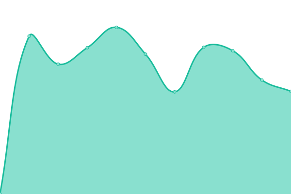
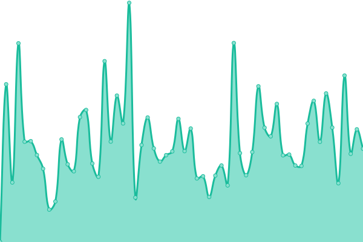

# [📈 Live Status](https://https://status.santhoshthomas.xyz): <!--live status--> **🟩 All systems operational**

This repository contains the open-source uptime monitor and status page for [Santhosh Thomas ](santhoshthomas.xyz), powered by [Upptime](https://github.com/upptime/upptime).

With [Upptime](https://upptime.js.org), you can get your own unlimited and free uptime monitor and status page, powered entirely by a GitHub repository. We use [Issues](https://github.com/sats268842/Raptor-Monitor/issues) as incident reports, [Actions](https://github.com/sats268842/Raptor-Monitor/actions) as uptime monitors, and [Pages](https://https://status.santhoshthomas.xyz) for the status page.

<!--start: status pages-->
<!-- This summary is generated by Upptime (https://github.com/upptime/upptime) -->
<!-- Do not edit this manually, your changes will be overwritten -->
<!-- prettier-ignore -->
| URL | Status | History | Response Time | Uptime |
| --- | ------ | ------- | ------------- | ------ |
|  [Raptor-Web](https://raptorapp.online) | 🟩 Up | [raptor-web.yml](https://github.com/sats268842/Raptor-Monitor/commits/HEAD/history/raptor-web.yml) | 

 805ms
     
 | 

<a href="https://status.raptorapp.online/history/raptor-web">90.46%</a>
    

|  [Raptor-Login-Api](https://raptorlogin.raptorapp.online) | 🟩 Up | [raptor-login-api.yml](https://github.com/sats268842/Raptor-Monitor/commits/HEAD/history/raptor-login-api.yml) | 

 889ms
     
 | 

<a href="https://status.raptorapp.online/history/raptor-login-api">99.59%</a>
    

|  [Raptor-Vehicle-Api](https://vehicle.raptorapp.online/vehicles) | 🟩 Up | [raptor-vehicle-api.yml](https://github.com/sats268842/Raptor-Monitor/commits/HEAD/history/raptor-vehicle-api.yml) | 

 1747ms
     
 | 

<a href="https://status.raptorapp.online/history/raptor-vehicle-api">99.69%</a>
    

|  [Raptor-Face-Api](http://raptorface.raptorapp.online/getcriminals) | 🟩 Up | [raptor-face-api.yml](https://github.com/sats268842/Raptor-Monitor/commits/HEAD/history/raptor-face-api.yml) | 

 2662ms
     
 | 

<a href="https://status.raptorapp.online/history/raptor-face-api">99.32%</a>
    

<!--end: status pages-->

[**Visit our status website →**](https://https://status.santhoshthomas.xyz)

## 📄 License

- Powered by: [Upptime](https://github.com/upptime/upptime)
- Code: [MIT](./LICENSE) © [Santhosh Thomas ](santhoshthomas.xyz)
- Data in the `./history` directory: [Open Database License](https://opendatacommons.org/licenses/odbl/1-0/)
